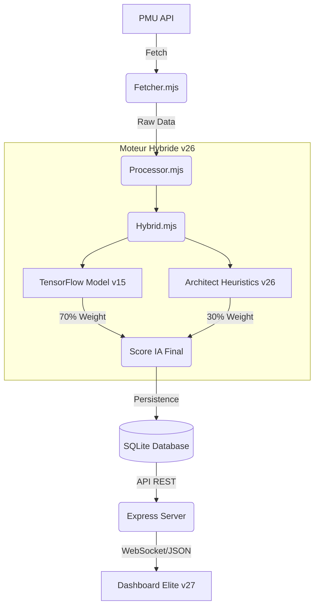

# 🏇 PMU Elite Punter - Architect v27

> **Système de Trading Hippique Haute Précision - Hybridation IA Deep Learning & Heuristiques Expertes**

[](LICENSE)
[](https://nodejs.org/)
[](https://www.tensorflow.org/js)
[](#-interface-premium)

---

## 🎯 Vision du Projet

**PMU Elite Punter** n'est pas un simple outil de pronostics. C'est un terminal d'analyse conçu pour les parieurs professionnels, intégrant les dernières avancées en **Machine Learning** et une expertise métier profonde via le moteur **Architect v26**. L'objectif est simple : **Dépasser les 80% de précision sur les sélections IA.**

---

## 🏗️ Architecture du Système



---

## ✨ Points Forts (v27)

### 🧠 Intelligence Artificielle "Architect v26"
Le cerveau du système a été unifié pour une précision chirurgicale :
- **Détection de Rentrée** : Analyse des dates de performance (ex: malus automatique si inactivité > 1 an).
- **Bonus de Spécialité** : Gain de +15% de score si le cheval court dans sa discipline de prédilection.
- **Apprentissage Profond** : Intégration globale de **TensorFlow.js** dès la synchronisation des données.

### 📊 Interface "Elite Glow"
Une UI pensée pour la prise de décision rapide :
- **Performance Glow** : Intensité lumineuse dynamique basée sur la probabilité de victoire.
- **Top Choice Labels** : Identification instantanée des meilleures opportunités.
- **Détails Enrichis** : Affichage des équipements (⚙️ Ferrage, 👁️ Oeillères), de la musique complète et du statut de catégorie (MONTEE/DESCENTE).

### 💰 Gestion de Capital
- **Kelly Criterion Dynamique** : Calculatrice de mise intégrée basée sur l'Edge IA.
- **Tracking ROI** : Calcul automatique du rendement par discipline et par hippodrome.

---

## 🚀 Installation & Lancement

### Chemin Rapide (Recommandé)
Le système inclut un script de démarrage intelligent qui gère l'environnement pour vous.

```bash
# 1. Cloner et installer
git clone https://github.com/samajesteduroyaume/pmu-prono.git
cd pmu-prono
npm install

# 2. Lancer le terminal intelligent
chmod +x start.sh
./start.sh
```

---

## 📡 API & Données

Le backend offre une API JSON robuste pour les intégrations tierces.

| Endpoint | Description |
| :--- | :--- |
| `GET /api/courses` | Liste des courses avec pagination & filtres |
| `GET /api/courses/:id/participants` | Détails complet avec scores IA Hybrides |
| `GET /api/performance` | ROI, taux de réussite et stats globales |
| `POST /api/sync` | Déclenchement manuel de la synchronisation |

---

## 🛠️ Stack Technique

- **Runtime** : Node.js (V3 Engine)
- **IA** : TensorFlow.js + Custom Heuristics Engine
- **Base de données** : SQLite3 avec indexation haute performance
- **Frontend** : Vanilla JS, Montserrat Typography, CSS Grid/Flexbox
- **DevOps** : Bash Automation (start.sh)

---

## 👨‍💻 Auteur & License

Développé avec passion par **Selim**. 
Ce projet est distribué sous licence **MIT**.

---

<div align="center">
  <strong>⭐ Si ce projet vous aide, n'hésitez pas à lui donner une étoile ! ⭐</strong>
</div>
